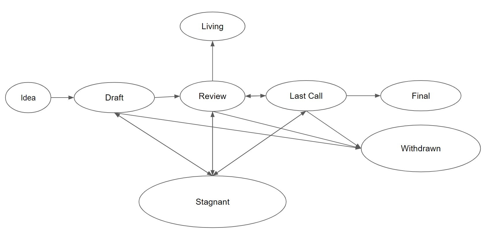

## What is an AIP?

AIP stands for Aurora Improvement Proposal. An AIP is a design document providing information to the Aurora community, or describing a new feature for Aurora or its processes or environment. The AIP should provide a concise technical specification of the feature and a rationale for the feature. The AIP author is responsible for building consensus within the community and documenting dissenting opinions.

## AIP Rationale

We intend AIPs to be the primary mechanisms for proposing new features, for collecting community technical input on an issue, and for documenting the design decisions that have gone into Aurora. Aurora have been built and it is currently maintained by Aurora Labs Team. The goal of AIP is not to slow down the development of Aurora, but to provide a mechanism for the community to discuss and share ideas. It is expected that AIPs development process to be fast paced and decisions, either positive or negative, to be taken promptly.

Because the AIPs are maintained as text files in a versioned repository, their revision history is the historical record of the feature proposal.

## AIP Types

There are three types of AIP:

-   A **Standards Track AIP** describes any change that affects Aurora components, such as—a change to Aurora engine contract, Rainbow Bridge, proposed application standards/conventions, or any change or addition that affects the interoperability of applications using Aurora. Standards Track AIPs consist of three parts—a design document, an implementation, and (if warranted) an update to the [formal specification](../spec). Furthermore, Standards Track AIPs can be broken down into the following categories:

    -   **Aurora Engine**: improvements requiring changes on the Engine contract. This involve any update that changes public interfaces, adds new precompiles, or make internal modifications that may have any impact on internal Aurora Smart Contracts behavior. The aurora engine contract is being actively updated and it undergoes a lot of internal changes often. Most of this changes can be seen on [Github](https://github.com/aurora-is-near/aurora-engine). While it is expected most impactful changes are documented as AIPs, we don't expect that every change goes through this process. Changes made on every release are documented on the [Changelog](https://github.com/aurora-is-near/aurora-engine/blob/master/CHANGES.md).
    -   **Rainbow Bridge**: improvements requiring changes on Rainbow Bridge contracts or derived tools such as connectors. This involve any update that changes public interfaces, propose new standards for bridge related contracts and other off-chain tools like relayers, or add new bridges or connectors. New bridges and connectors can be build without requiring undergoing the AIP process, since the underlying technology is open, decentralized and trustless, however, it is expected to be communicated as an AIP for better visibility and involvement of the Aurora community.
    -   **Interface**: includes improvements around Aurora [API/RPC](https://doc.aurora.dev/compat/rpc) specifications. In general Aurora RPC will make the best effort to be compliant with as many Ethereum RPC methods as possible; however in some cases this won't be possible due to fundamental differences between Aurora and Ethereum. It is possible that some methods are created specifically for Aurora, they should be documented as an AIP.
    -   **ARC**: application-level standards and conventions, including contract standards. In general all ERC standards should be considered ARC standards, given that Aurora provides a fully compatible EVM. This category is open for those ARC that might not be a good fit on Ethereum but are relevant to Aurora.

-   A **Meta AIP** describes a process surrounding Aurora or proposes a change to (or an event in) a process. Process AIPs are like Standards Track AIPs but apply to areas other than the protocol or the contracts. They may propose an implementation, but not to Aurora's codebase; they often require community consensus; unlike Informational AIPs, they are more than recommendations, and users are typically not free to ignore them. Examples include procedures, guidelines, changes to the decision-making process, role and responsibility for Aurora DAO, and changes to the tools or environment used in Aurora development.

-   An **Informational AIP** describes an Aurora design issue, or provides general guidelines or information to the Aurora community, but does not propose a new feature. Informational AIPs do not necessarily represent Aurora community consensus or a recommendation, so users and implementers are free to ignore Informational AIPs or follow their advice.

It is highly recommended that a single AIP contain a single key proposal or new idea. The more focused the AIP, the more successful it tends to be.

An AIP must meet certain minimum criteria. It must be a clear and complete description of the proposed enhancement. The enhancement must represent a net improvement. The proposed implementation, if applicable, must be solid, sounds and must not complicate the design unduly.

## AIP Work Flow

### Shepherding an AIP

Parties involved in the process are you, the champion or _AIP author_, the [_AIP editors_](#aip-editors), and the [_Aurora Core Developers_](https://github.com/orgs/aurora-is-near/people).

Before you begin writing a formal AIP, you should vet your idea. Ask the Aurora community first if an idea is original to avoid wasting time on something that will be rejected based on prior research. It is thus recommended to open a discussion thread on [the Aurora forum](https://forum.aurora.dev/). To have faster access to core developers a [Github Discussion](https://github.com/aurora-is-near/aurora-engine/discussions) is also recommended, but for major visibility the forum is preferred.

Once the idea has been vetted, your next responsibility will be to present (by means of an AIP) the idea to the reviewers and all interested parties, invite editors, developers, and the community to give feedback on the aforementioned channels. You should try and gauge whether the interest in your AIP is commensurate with both the work involved in implementing it and how many parties will have to conform to it.

### Core AIPs

For Core AIPs, given that they require an implementation to be considered **Final** (see "AIPs Process" below), you will need to either provide an implementation or convince Core Developers to implement your AIP. In some cases an AIP might be considered relevant and be approved, but of lower priority to be done by Core Developers in a short timeline. In these cases consider applying for a [bounty](https://github.com/aurora-is-near/bounties).

Consider joining [Friday Alpha Leaks](https://www.youtube.com/c/auroraisnear/videos), where weekly goals and highlights of Aurora is broadly presented to the community.

### AIP Process

The following is the standardization process for all AIPs in all tracks:

<!-- TODO: Download file -->

**Idea** - An idea that is pre-draft. This is not tracked within the AIP Repository.

**Draft** - The first formally tracked stage of an AIP in development. An AIP is merged by an AIP Editor into the AIP repository when properly formatted.

**Review** - An AIP Author marks an AIP as ready for and requesting Peer Review.

**Last Call** - This is the final review window for an AIP before moving to `Final`. An AIP editor will assign `Last Call` status and set a review end date (`last-call-deadline`), typically 14 days later, but could be less time for some AIPs.

If this period results in necessary normative changes it will revert the AIP to `Review`.

**Final** - This AIP represents the final standard. A Final AIP exists in a state of finality and should only be updated to correct errata and add non-normative clarifications.

**Stagnant** - Any AIP in `Draft` or `Review` or `Last Call` if inactive for a period of 6 months or greater is moved to `Stagnant`. An AIP may be resurrected from this state by Authors or AIP Editors through moving it back to `Draft` or it's earlier status. If not resurrected, a proposal may stay forever in this status.

> _AIP Authors are notified of any change to the status of their AIP_

**Withdrawn** - The AIP Author(s) have withdrawn the proposed AIP. This state has finality and can no longer be resurrected using this AIP number. If the idea is pursued at later date it is considered a new proposal.

**Living** - A special status for AIPs that are designed to be continually updated and not reach a state of finality. This includes most notably AIP-1.

## What belongs in a successful AIP?

Each AIP should have the following parts:

-   Preamble - RFC 822 style headers containing metadata about the AIP, including the AIP number, a short descriptive title (limited to a maximum of 44 characters), a description (limited to a maximum of 140 characters), and the author details. Irrespective of the category, the title and description should not include AIP number. See [below](./aip-1.md#aip-header-preamble) for details.
-   Abstract - Abstract is a multi-sentence (short paragraph) technical summary. This should be a very terse and human-readable version of the specification section. Someone should be able to read only the abstract to get the gist of what this specification does.
-   Motivation (\*optional) - A motivation section is critical for AIPs that want to change the Aurora protocol. It should clearly explain why the existing protocol specification is inadequate to address the problem that the AIP solves. AIP submissions without sufficient motivation may be rejected outright.
-   Specification - The technical specification should describe in the details the modifications to the protocol or the interfaces, in such a way that implementations can be done based on the contents of the specification.
-   Rationale - The rationale fleshes out the specification by describing what motivated the design and why particular design decisions were made. It should describe alternate designs that were considered and related work, e.g. how the feature is supported in other languages. The rationale should discuss important objections or concerns raised during discussion around the AIP.
-   Backwards Compatibility - All AIPs that introduce backwards incompatibilities must include a section describing these incompatibilities and their severity. The AIP must explain how the author proposes to deal with these incompatibilities. AIP submissions without a sufficient backwards compatibility treatise may be rejected outright.
-   Test Cases - Test cases for an implementation are mandatory for AIPa that are affecting consensus changes. Tests should either be inlined in the AIP as data (such as input/expected output pairs, or included in `../assets/aip-#/<filename>`.
-   Reference Implementation - An optional section that contains a reference/example implementation that people can use to assist in understanding or implementing this specification.
-   Security Considerations - All AIPs must contain a section that discusses the security implications/considerations relevant to the proposed change. Include information that might be important for security discussions, surfaces risks and can be used throughout the life-cycle of the proposal. E.g. include security-relevant design decisions, concerns, important discussions, implementation-specific guidance and pitfalls, an outline of threats and risks and how they are being addressed. AIP submissions missing the "Security Considerations" section will be rejected. An AIP cannot proceed to status "Final" without a Security Considerations discussion deemed sufficient by the reviewers.
-   Copyright Waiver - All AIPs must be in the public domain. See the bottom of this AIP for an example copyright waiver.

## AIP Formats and Templates

AIP should be written in [markdown](https://github.com/adam-p/markdown-here/wiki/Markdown-Cheatsheet) format. There is a [template](../aip-template.md) to follow. When creating a new AIP use number 9999 as a boilerplate, that will be updated by AIP editor before merging the PR.

## AIP Header Preamble

Each AIP must begin with an [RFC 822](https://www.ietf.org/rfc/rfc822.txt) style header preamble, preceded and followed by three hyphens (`---`). This header is also termed ["front matter" by Jekyll](https://jekyllrb.com/docs/front-matter/). The headers must appear in the following order.

`aip`: _AIP number_ (this is determined by the AIP editor)

`title`: _The AIP title is a few words, not a complete sentence_

`description`: _Description is one full (short) sentence_

`author`: _The list of the author's or authors' name(s) and/or username(s), or name(s) and email(s). Details are below._

`discussions-to`: _The url pointing to the official discussion thread_

`status`: _Draft, Review, Last Call, Final, Stagnant, Withdrawn, Living_

`last-call-deadline`: _The date last call period ends on_ (Optional field, only needed when status is `Last Call`)

`type`: _One of `Standards Track`, `Meta`, or `Informational`_

`category`: _One of `Aurora-Engine`, `Rainbow-Bridge`, `Interface`, or `ARC`_ (Optional field, only needed for `Standards Track` AIPs)

`created`: _Date the AIP was created on_

`requires`: _AIP number(s)_ (Optional field)

`withdrawal-reason`: _A sentence explaining why the AIP was withdrawn._ (Optional field, only needed when status is `Withdrawn`)

Headers that permit lists must separate elements with commas.

Headers requiring dates will always do so in the format of ISO 8601 (yyyy-mm-dd).

#### `author` header

The `author` header lists the names, email addresses or usernames of the authors/owners of the AIP. Those who prefer anonymity may use a username only, or a first name and a username. The format of the `author` header value must be:

> Random J. User &lt;address@dom.ain&gt;

or

> Random J. User (@username)

if the email address or GitHub username is included, and

> Random J. User

if the email address is not given.

It is not possible to use both an email and a GitHub username at the same time. If important to include both, one could include their name twice, once with the GitHub username, and once with the email.

At least one author must use a GitHub username, in order to get notified on change requests and have the capability to approve or reject them.

#### `discussions-to` header

While an AIP is a draft, a `discussions-to` header will indicate the URL where the AIP is being discussed.

The preferred discussion URL is a topic on [Aurora Forum](https://forum.aurora.dev/). The URL cannot point to Github pull requests, any URL which is ephemeral, and any URL which can get locked over time (i.e. Reddit topics).

#### `type` header

The `type` header specifies the type of AIP: Standards Track, Meta, or Informational. If the track is Standards please include the subcategory (Aurora-Engine, Rainbow-Bridge, Interface, ARC).

#### `category` header

The `category` header specifies the AIP's category. This is required for standards-track AIPs only.

#### `created` header

The `created` header records the date that the AIP was assigned a number. Both headers should be in yyyy-mm-dd format, e.g. 2001-08-14.

#### `requires` header

AIPs may have a `requires` header, indicating the AIP numbers that this AIP depends on.

## Linking to External Resources

Links to external resources **SHOULD NOT** be included. External resources may disappear, move, or change unexpectedly.

## Linking to other AIPs

References to other AIPs should follow the format `AIP-N` where `N` is the AIP number you are referring to. Each AIP that is referenced in an AIP **MUST** be accompanied by a relative markdown link the first time it is referenced, and **MAY** be accompanied by a link on subsequent references. The link **MUST** always be done via relative paths so that the links work in this GitHub repository, forks of this repository, the main AIPs site, mirrors of the main AIP site, etc. For example, you would link to this AIP with `[AIP-1](./aip-1.md)`.

## Auxiliary Files

Images, diagrams and auxiliary files should be included in a subdirectory of the `assets` folder for that AIP as follows: `assets/aip-#`. When linking to an image in the AIP, use relative links such as `../assets/aip-1/image.png`.

## Transferring AIP Ownership

It occasionally becomes necessary to transfer ownership of AIPs to a new champion. In general, we'd like to retain the original author as a co-author of the transferred AIP, but that's really up to the original author. A good reason to transfer ownership is because the original author no longer has the time or interest in updating it or following through with the AIP process, or has fallen off the face of the 'net (i.e. is unreachable or isn't responding to email). A bad reason to transfer ownership is because you don't agree with the direction of the AIP. We try to build consensus around an AIP, but if that's not possible, you can always submit a competing AIP.

If you are interested in assuming ownership of an AIP, send a message asking to take over, addressed to both the original author and the AIP editor. If the original author doesn't respond to the email in a timely manner, the AIP editor will make a unilateral decision (it's not like such decisions can't be reversed :)).

## AIP Editors

The current AIP editors are

-   Arto Bendiken (@artob)
-   Marcelo Fornet (@mfornet)
-   Joshua Bouw (@joshuajbouw)
-   Kirill Abramov (@sept-en)

<!-- Emeritus AIP editors are -->
<!-- Include section after there is an emeritus AIP Editor -->

## AIP Editor Responsibilities

For each new AIP that comes in, an editor does the following:

-   Read the AIP to check if it is ready: sound and complete. The ideas must make technical sense, even if they don't seem likely to get to final status.
-   The title should accurately describe the content.
-   Check the AIP for language (spelling, grammar, sentence structure, etc.), markup (GitHub flavored Markdown), code style

If the AIP isn't ready, the editor will send it back to the author for revision, with specific instructions.

Once the AIP is ready for the repository, the AIP editor will:

-   Assign an AIP number (generally the PR number, but the decision is with the editors)
-   Merge the corresponding [pull request](https://github.com/aurora-is-near/AIPs/pulls)
-   Send a message back to the AIP author with the next step.

Many AIPs are written and maintained by developers with write access to the Aurora codebase. The AIP editors monitor AIP changes, and correct any structure, grammar, spelling, or markup mistakes we see.

The editors don't pass judgment on AIPs while editing. They merely do the administrative & editorial part.

## Style Guide

### AIP numbers

When referring to an AIP by number, it should be written in the hyphenated form `AIP-X` where `X` is the AIP's assigned number.

### RFC 2119

AIPs are encouraged to follow [RFC 2119](https://www.ietf.org/rfc/rfc2119.txt) for terminology and to insert the following at the beginning of the Specification section:

> The key words “MUST”, “MUST NOT”, “REQUIRED”, “SHALL”, “SHALL NOT”, “SHOULD”, “SHOULD NOT”, “RECOMMENDED”, “MAY”, and “OPTIONAL” in this document are to be interpreted as described in RFC 2119.

## History

This document was derived heavily from [Ethereum's EIP-1](https://github.com/ethereum/EIPs/blob/master/EIPS/eip-1.md)

## Copyright

Copyright and related rights waived via [CC0](https://creativecommons.org/publicdomain/zero/1.0/).
