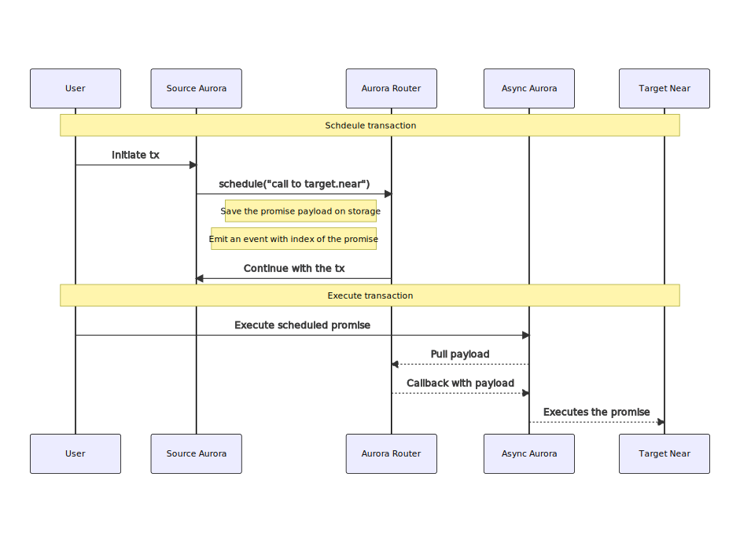
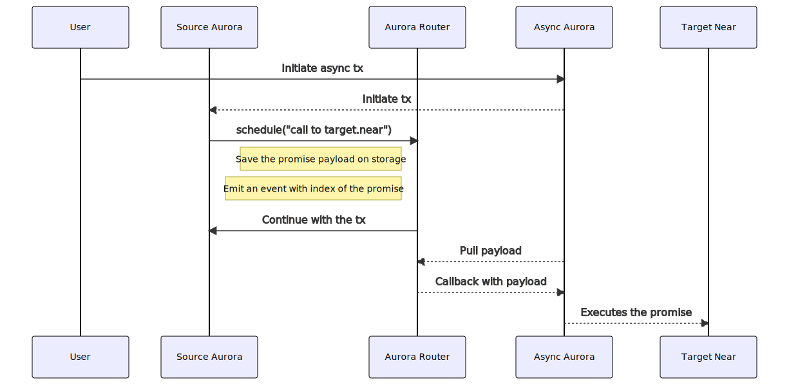

Previous discussions about cross contract calls can be found at:

-   https://github.com/aurora-is-near/aurora-engine/discussions/461
-   https://github.com/aurora-is-near/aurora-engine/discussions/291

## Abstract

Establish a mechanism that allows Aurora smart contracts to communicate with NEAR smart contracts via _Cross Contract Calls_.

This mechanism allows the interaction from Aurora contracts with all contracts on NEAR ecosystem, including new instances of Aurora engines if they were to be deployed. It works in two steps: recording in storage the arguments to the promise, and finally triggering the promise from a separate proxy contract. Both steps can be executed in a single transaction, such that it is perceived from the network as a single "atomic" action.

In addition this mechanism allows to authenticate on NEAR side the address of the message sender that initiated the call on Aurora.

## Motivation

Smart contracts composability is a key feature of blockchain ecosystems, having multiple contracts in the same ecosystem allow the creation of complex application that compose each smart contract as lego pieces. NEAR allows communication between smart contracts via Cross Contract Calls, however it is not trivial for contracts deployed inside Aurora to communicate with other contracts on NEAR (outside of Aurora).

This AIP will create a standard that allows communication between native Aurora smart contracts and regular NEAR smart contracts, removing the gap between the two ecosystems. This implies that every contract deployed either on NEAR or in Aurora (such as oracles, dexes or market places), can be used in any of the other ecosystem.

While this exposes Aurora smart contracts to the NEAR asynchronous runtime, it will only affect those contracts that will use the Cross Contract Calls mechanism.

## Specification

There are two contracts introduced:

-   _Aurora Router_: a precompile in Aurora that will be responsible for keeping track of all promises that needs to be created. Promises are removed once they are scheduled for execution.
-   _Async Aurora_: a smart contract in NEAR responsible for pulling promise from Aurora Router and executing them.

This is a diagram about how cross contracts calls will work in two steps:



The main workflow is as follows:

-   The user sends a transaction to Aurora where a promise is scheduled inside _Aurora Router_. An index for this promise is generated.
-   A second transaction is sent to Async Aurora passing the index of the promise as an argument. This will pull the proper arguments from Aurora Router contract and execute the promise.

### Interface

The following is the interfaces for both contracts. See more details in [Reference implementation section](#reference-implementation).

```rs
trait AuroraRouter {
    pub fn schedule(&mut self, promises: Vec<Promise>);

    pub fn pull(&mut self, promises_index: Vec<u64>, total_gas: Gas, total_balance: Balance) -> Vec<Option<Vec<Promise>>>;
}

trait AsyncAurora {
    pub fn pull_and_execute(&mut self, aurora: AccountId, promise_index: Vec<u64>, total_gas: Gas, total_balance: Balance);

    pub fn submit_and_execute(&mut self, aurora: AccountId, submit_payload: Vec<u8>, total_gas: Gas, total_balance: Balance);
}
```

### Aurora Router

Aurora Router is a precompile on Aurora with the address computed as `keccak("auroraRouter")[12:] = 0x5fd6651543676f113735613f9ccc29d9ff0a5162`. See how to interact with its functions on [reference.rs](../assets/aip-cross_contract_calls/reference.rs).

_AuroraRouter::schedule_ allows the user to store a list of promises on the contract. No validation is performed on each individual promise, so it is up to the user creating it to make sure it is correct. Promises scheduled in the same batch can be combined using NEAR combinators: `then` / `and`. You can reference to a particular promise using as index the position on the list.

When `schedule` is called an event is emitted with using as value promise_index, which is a unique identifier for the promise.

_AuroraRouter::pull_ receives a list of promise indexes and the total gas and balance available for executions. It loads relevant scheduled promises, verifies there is enough gas and balance for execution, removes the promises from storage and returns the promises. This function can only be called from AsyncAurora. Promises will be removed from storage only if it is guaranteed that enough resources are dedicated to it.

The implicit address of the AsyncAurora contract needs to be known in advance before deploying this new feature, and should

It allows fetching a batch of promises at the same time. For each promise index, None is returned if there is not such promise at that position, otherwise the promises scheduled are returned. Batches are relevant to manage multiple calls to `schedule` in a single transaction.

#### Storage

Promises should be stored on the state associated with the address given to Aurora Router precompile. No special layout is required, so it is left to the implementation to decide how it will be stored.

Note: There is no state staking enforced on promise scheduling, so a potential vector of attack is a user that schedules to many promises but don't executes them.

#### Gas cost

A proper estimation of the gas used by the precompile is not provided in this standard. It is recommended that a future standard will propose a mechanism that allows estimating the gas cost of each of the precompiles. However, to prevent attackers for bloating the state at zero cost, the total cost should include the cost of writing to storage.

### Async Aurora

_AsyncAurora::pull_and_execute_ calls Aurora Router precompile inside Aurora, pull relevant promises and execute them. To find relevant promises, all promises are filtered, and only those generated by the expected precompile are taken into account.

_AsyncAurora::submit_and_execute_ similar to `pull_and_execute` function, but allows submitting an aurora transaction and executing the promises in a single NEAR transaction. It first call submit in aurora, then reads all events generated from the result and automatically detects the promise indexes that needs to be executed. See [workflow below](#one-transaction).

It is possible that the first part of the transaction succeeds (the call to `aurora::submit`), but the second part fails. This can happen if attached gas or balance is not enough. In that case the second part needs to be executed using _pull_and_execute_ in a separate transaction.

Notes:

-   The balance not used for the execution of the promises must be refunded to the predecessor account id.
-   The account id of the particular aurora contract must be specified to disambiguate between different deployed instances.

#### One transaction

Workflow about the of how to execute a cross contract call from Aurora to NEAR in a single transaction.



#### RPC Extension

As noted in the diagram, to execute the whole workflow in a single transaction, it must be sent first to Async Aurora contract, rather than to Aurora contract. A new RPC endpoint is created: `aurora_sendRawTransaction` such that transactions are sent to `AsyncAurora::submit_and_execute`. It is similar to [`eth_sendRawTransaction`](https://eth.wiki/en/json-rpc/API#eth_sendRawTransaction). The value of `aurora: AccountId` parameter is automatically deduced from the chain id of the transaction. For `total_gas: Gas` and `total_balance: Balance`, it is recommended to use sensible defaults like `total_gas = 300Tgas` and `total_balance = 0 NEAR`.

When the transaction is signed, there is no mechanism that prevents a malicious relayer submitting the payload directly to Aurora rather than Async Aurora. If this is not expected the transaction must fail at the application level. Otherwise the application must assume the second part of the transaction will be executed in a later transaction.

### Authentication

Promises sent from Async Aurora to target contracts are wrapped in an envelop that provides information from the original sender of the message inside of Aurora, and the Account Id of the Aurora contract where it was originated.

#### Aurora Router -> Async Aurora

The router is responsible to wrap the payload with the address of the `msg.sender`.

| Field   | Size     | Description                                       |
| ------- | -------- | ------------------------------------------------- |
| Version | 1 byte   | Byte zero (0x00). Used for versioning             |
| Address | 20 bytes | Address of the sender of the message (msg.sender) |
| Payload | M bytes  | Extra payload                                     |

#### Async Aurora -> Target Contract

Async Aurora contract is responsible in wrapping the payload from the router, with the account id that was used to pull this information from. This will avoid the conflicts when the same address is used to send a message from different aurora instances.

| Field           | Size     | Description                                                     |
| --------------- | -------- | --------------------------------------------------------------- |
| Version         | 1 byte   | Byte zero (0x00). Used for versioning                           |
| Account Id Size | 1 bytes  | Account ID size of the Aurora instance that generated the call. |
| Account Id      | N bytes  | Account ID of the Aurora instance that generated the call.      |
| Address         | 20 bytes | Address of the sender of the message (msg.sender)               |
| Payload         | M bytes  | Extra payload                                                   |

The receiver of this message should verify the predecessor account id to be Async Aurora contract, validate the envelope and extract the payload. Note that even if the predecessor account id is known to be Async Aurora contract, the Account Id in the envelop must be verified to be from the expected aurora instance. This should be done either by whitelisting the account id on the target contract, or by using a whitelist registry. This prevents an attacker to deploy a malicious instance that generates "valid" payloads on behalf of accounts they don't control.

### Aurora SDK

While not mandatory, it is advisable that following up to the implementation of this AIP, an SDK is provided, such that developers don't need to interact with low level primitives from Aurora Router or Async Aurora. Design of the SDK is out of scope for this AIP.

## Rationale

The main goals of the design is to provide an interface as simple as possible for Aurora users to communicate with other contracts in NEAR ecosystem. While we acknowledge the interface is rather complex, the whole complexity arrives by making possible the following features:

-   Decentralized and Open: Developers and users are free to use Cross Contract Call interfaces without requiring any approval.
-   Trustless: Security of the system doesn't depend on any single entity.
-   Authentication: Target contract can verify the origin.
-   Multi-Aurora ecosystem: Every future deployment of aurora engine can use the same infrastructure to execute Cross Contract Calls.

### Precompile

Even if Aurora Router can be built as a regular smart contract in Aurora (with no changes to the engine) it is built as a precompile to allow having the same address on every future aurora instance deployed. This is not only important for usability, but also to allow the AsyncAurora contract to safely filter all relevant events by the address of the precompile, regardless of the instance where it was generated. An extra benefit of building the Router as a precompile is that it can be more performant, and specialized.

## Backwards Compatibility

All previous contracts should work as expected. Even though an engine upgrade is required, no breaking change is added in this standard.

## Test Cases

The following are some high level descriptions of some workflows with there expected outcomes:

**Two transaction successful:** Check the workflow using two transactions.

-   Check the payload is augmented on the router with the proper envelop (version, msg.sender)
-   Check the payload is augmented on async aurora with the proper envelop (version, account_id, msg.sender)
-   Check the promise is removed from router storage after pulling it.
-   Check the promise was successfully created.

**One transaction successful:** Check the workflow using one transactions.

**Multiple schedules per block:** Using the one transaction workflow, two different transactions are executed on the same block. It should be the case, that each transaction pulls the write promises from storage.

**Pull promise from invalid contract:** Try to pull a promise after it was scheduled, from a contract different than Async Aurora. The promise should not be deleted.

**Revert schedule:** If a call to schedule is made, but later in the EVM execution it is reverted, the schedule operation must be reverted as well.

**Gas / Balance too high:** If the required gas or balance is too high compared to the provided gas and balance by async aurora, the transaction must not be pulled out (i.e removed) and Async Aurora contract must not execute the promise.

## Reference Implementation

It is provided a detailed implementation of these contracts in [reference.rs](../assets/aip-cross_contract_calls/reference.rs).

## Security Considerations

### Precompile

This standard introduces a new precompile to Aurora engine. The scope of this precompile is limited to emit events on its own behalf, and provide a deterministic address to be accessed from different deployments. The address at which the precompile is accessed is built safely. No promise is scheduled on behalf of Aurora contract itself.

On the other hand, almost arbitrary cross contract calls can be created on behalf of Async Aurora. While there is no special risk about this, it implies that no privilege should be given to the contract.

### Storage abuse on schedule

The schedule function on Aurora Router can be used without requiring staking any balance. This means that an attacker can use the `schedule` function to increase the state, without ever calling `pull`. Notice this will not affect the router or the cross contract call process in general. It is not addressed in this standard, since attackers can abuse state bloating in multiple ways that don't depend on this precompile, so addressing this problem requires a generic approach.

### Gas cost

The lack of proper estimation of the gas cost might incur in an abuse on the RPC relaying txs on behalf of users, where transactions are undercharged. I.e the gas price to be paid in ETH by the user for execution is significantly lower than the gas price paid in NEAR by the RPC relayer. Right now this problem should be solved at the relayer site, however it is expected that a future standard will propose a mechanism to properly estimate the gas cost of each precompile execution.

### NEAR transactions

With the introduction of the RPC method `aurora_sendRawTransaction`, relayers will be executing arbitrary calls to NEAR contracts on behalf of user address. There is a mechanism in place on the engine that allows the relayer to get refunded in ETH depending on the total gas used on Aurora, however this mechanism is not extended to the extra cross contract calls created. This means the relayer will be paying for more gas than the gas they are getting refunded for. It is recommended to address this problem at the relayer site, where it only allows calling to `aurora_sendRawTransaction` when the user has paid in advance for this gas, using an alternative mechanism or when it is ok to cover the gas at zero cost.

### Upgradability

Since Aurora Router is a precompile, it should be upgraded using the same mechanisms used for upgrading Aurora Engine. It is advisable to set up a similar process that allows the same entity that control Aurora Engine, to upgrade Async Aurora. While it is not expected Async Aurora to be upgraded frequently, smart contracts are always subject to bugs, and potential use cases non supported by this standard could appear in the future.

### Pausing

While it is not part of the standard, it is advisable to provide two separate flags that allows pausing altogether Aurora Router and Async Aurora. While this feature is not expected to be triggered, it can be used if some active exploit could happen. Entities allowed to pause can have looser permissions that entities allowed to unpause.

It is very important that entities with the ability to Upgrade and Pause these contracts are held accountable, with the intention of keeping the contracts trustless and decentralized.

## Copyright

Copyright and related rights waived via [CC0](https://creativecommons.org/publicdomain/zero/1.0/).
