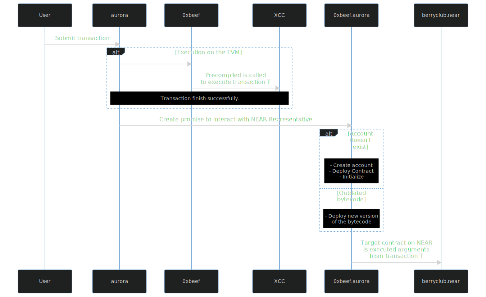
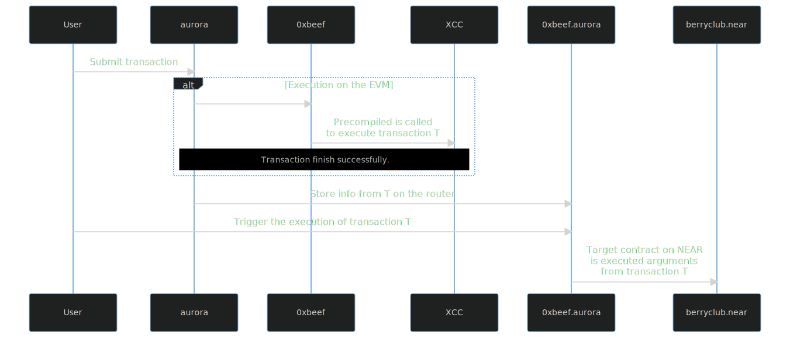

---
aip:
title: Cross Contract Calls
description: Allow communication between Aurora and NEAR smart contracts.
author: Michael Birch (@birchmd), Marcelo Fornet (@mfornet)
discussions-to: https://forum.aurora.dev/t/cross-contract-calls/304
status: Draft
type: Standards Track
category: Aurora-Engine
created: 2022-05-27
---

Find previous discussions about cross-contract calls at:

-   https://github.com/aurora-is-near/aurora-engine/discussions/461
-   https://github.com/aurora-is-near/aurora-engine/discussions/291
-   https://github.com/aurora-is-near/AIPs/pull/2

## Abstract

Establish a mechanism that allows Aurora smart contracts to communicate with NEAR smart contracts via NEAR native _Cross Contract Calls_. It will be possible by introducing a new pre-compile that will permit any smart contract to call a NEAR smart contract. A new NEAR contract will be created per Aurora address on demand to provide authentication.

## Motivation

Smart contracts composability is a key feature of blockchain ecosystems. NEAR allows communication between smart contracts via the Cross Contract Calls interface. However, it is not trivial for contracts deployed inside Aurora to communicate with other contracts on NEAR (outside of Aurora).

This AIP will create a standard for communication between native Aurora smart contracts and NEAR smart contracts, removing the gap between the two ecosystems. With this feature, NEAR applications such as DEXes, DAOs, Oracles, and marketplaces will be available for developers on Aurora.

While this exposes Aurora smart contracts to the NEAR asynchronous runtime, it will only affect those contracts using the Cross Contract Calls mechanism.

## Specification

A new pre-compile, Cross Contract Call, is added to the Aurora EVM. The input to the pre-compile is the description of a promise to be created. If the pre-compile is called successfully (i.e., the overall transaction doesn't get reverted), it will trigger a cross contract call initiated from aurora to a router account on NEAR. Each address in aurora will have a unique router as a NEAR representative. The router will start the described promise.



This diagram shows how the EVM executes the transaction under the hood. First, the `User` creates a transaction to `aurora`. Then the EVM is spawned and executes the contract at the address `0xbeef`. This contract calls the Cross Contract Call (`XCC`) pre-compile with the description of a promise to call the NEAR contract `berryclub.near`. If it is the first time `0xbeef` calls the Cross Contract Call pre-compile, the `aurora` contract creates a new router at `0xbeef.aurora`. The router account id is derived from the caller to the pre-compile. The router will initiate the promise described by the input to the pre-compile. The target contract uses the router to authenticate the caller.

### Address

The address of the precompile is `0x516cded1d16af10cad47d6d49128e2eb7d27b372`. It is derived using `keccak("nearCrossContractCall")[12..]`.

### Execution mode

There are two modes to initiate the transaction. The eager mode will execute the promise in the same transaction that originated it. The diagram above describes how this mechanism works.

On the other hand, with a delayed execution mode, the promise description will be stored in the router to be executed later by a third party. Any NEAR account can trigger the execution of the kept promise by calling the `execute` method of the router.



Note that any other NEAR account can initiate the second transaction undertaken by the user. This is useful for cases where the user doesn't have a NEAR account, and there is a third party providing a service to execute certain transactions.

The eager method provides an "atomic" way to execute the promise in a single NEAR transaction, with the caveat that the gas attached must be enough to cover the EVM execution and the NEAR promise execution. The delayed method provides a way to execute the promise in a separate NEAR transaction but requires a third-party NEAR account. Delayed transactions stored on the router don't expire.

<!-- Explain how the Promise Id works on the router. -->

### Asynchronous environment and callbacks

The usage of this pre-compile will expose the Aurora contract to the NEAR asynchronous environment. The initial EVM transaction on `aurora` may succeed, creating the promise, but the execution of the target contract fails. In this scenario, all state changes performed during the EVM execution will be persisted, but not the changes during the promise execution.

The promise created by the router may contain NEAR combinators such as `and` and `then`. If the contract on `aurora` wants to act on the result of the call, it must attach a callback (using combinator `then`) that calls itself. It is possible via the method `call` on the `aurora` contract. In particular, `aurora` exposes a pre-compile to access the result of previous receipts.

### Input

The input to the precompile is a `CrossContractCallArgs` object serialized using [Borsh](https://borsh.io/). The object schema using rust syntax is:

```rust
pub enum CrossContractCallArgs {
    Eager(PromiseArgs),
    Delayed(PromiseArgs),
}

type AccountId = String;
type Yocto = u128;
type NearGas = u64;

pub enum PromiseArgs {
    Create(PromiseCreateArgs),
    Callback(PromiseWithCallbackArgs),
    Recursive(NearPromise),
}

pub struct PromiseCreateArgs {
    pub target_account_id: AccountId,
    pub method: String,
    pub args: Vec<u8>,
    pub attached_balance: Yocto,
    pub attached_gas: NearGas,
}

pub struct PromiseWithCallbackArgs {
    pub base: PromiseCreateArgs,
    pub callback: PromiseCreateArgs,
}

pub enum NearPromise {
    Simple(SimpleNearPromise),
    Then {
        base: NearPromise,
        callback: SimpleNearPromise,
    },
    And(Vec<NearPromise>),
}

pub enum SimpleNearPromise {
    Create(PromiseCreateArgs),
    Batch(PromiseBatchAction),
}

pub struct PromiseBatchAction {
    pub target_account_id: AccountId,
    pub actions: Vec<PromiseAction>,
}

pub enum NearPublicKey {
    Ed25519([u8; 32]),
    Secp256k1([u8; 64]),
}

pub enum PromiseAction {
    CreateAccount,
    Transfer {
        amount: Yocto,
    },
    DeployConotract {
        code: Vec<u8>,
    },
    FunctionCall {
        name: String,
        args: Vec<u8>,
        attached_yocto: Yocto,
        gas: NearGas,
    },
    Stake {
        amount: Yocto,
        public_key: NearPublicKey,
    },
    AddFullAccessKey {
        public_key: NearPublicKey,
        nonce: u64,
    },
    AddFunctionCallKey {
        public_key: NearPublicKey,
        nonce: u64,
        allowance: Yocto,
        receiver_id: AccountId,
        function_names: String,
    },
    DeleteKey {
        public_key: NearPublicKey,
    },
    DeleteAccount {
        beneficiary_id: AccountId,
    },
}
```

### State Fee

The first time an aurora contract interacts with the pre-compile, it must pay a fee of 2 NEAR to cover the storage. [State staking](https://nomicon.io/Economics/#state-stake) mechanism on NEAR requires a price per byte for covering the storage used. Ultimately the balance to cover the state is paid by `aurora` account on NEAR. To avoid being abused, the user must cover the fee for creating the router in advance. To do it, the contract address initiating the promise must give an allowance of two wNEAR (ERC-20 token in Aurora) to the pre-compile address.

### Gas cost

The EVM uses the following formula to compute the EVM gas cost.

```
cost = cross_contract_call_base + cross_contract_call_byte * input_len + attached_gas / cross_contract_call_near_gas

input_len: length of the input in bytes.
attached_gas: gas attached to the transaction.
cross_contract_call_base: 323_000
cross_contract_call_byte: 3
cross_contract_call_near_gas: 175_000_000
```

## Rationale

The main goal of the design is to provide an interface as simple as possible for Aurora users to communicate with other contracts in the NEAR ecosystem. While we acknowledge the interface is rather complex, the whole complexity arrives by making possible the following features:

-   Decentralized and Open: Developers and users can use Cross Contract Call interfaces without requiring approval.
-   Trustless: The system's security doesn't depend on any single entity.
-   Authentication: The target contract can verify the origin.
-   Multi-Aurora ecosystem: Every future deployment of the aurora engine can use the same infrastructure to execute Cross Contract Calls.

## Backwards Compatibility

All previous contracts should work as expected.

## Reference Implementation

Links to implementation on the engine:

-   https://github.com/aurora-is-near/aurora-engine/pull/560

## Security Considerations

### Precompile

This standard introduces a new pre-compile to the Aurora engine. This pre-compile should have write access to a limited subset of the storage that doesn't affect EVM execution. It is responsible for initiating cross contract calls, but only to subaccounts of `aurora` created by itself. In particular, it can't start a direct cross contract call to any other NEAR account, including itself.

## Copyright

Copyright and related rights waived via [CC0](https://creativecommons.org/publicdomain/zero/1.0/).
